<!-- @format -->

# 시스템 관제 자동화 스크립트 개발

1. 개요

Docker를 이용하여

2. 실행환경

- OS: macOS
- Python: 3.13.2
- 개발 도구: Terminal, Docker

3. 수행 리스트

- [✔] Docker Ubuntu 22.04 환경 구축
- [✔] SSH 서버 설치 및 보안 설정
- [✔] 방화벽(UFW) 설정
- [✔] 사용자 계정 생성
- [✔] 그룹 생성 및 사용자 그룹 할당
- [✔] 프로젝트 디렉토리 구조 생성
- [✔] 디렉토리 및 파일 권한 설정
- [✔] 환경 변수 설정
- [✔] API Key 파일 생성
- [✔] Agent 서비스 작성 및 실행
- [✔] 서비스 포트(15034) 개방 확인
- [✔] monitor.sh 모니터링 스크립트 작성
- [✔] 모니터링 로그 저장 기능 구현
- [✔] Cron 자동 실행 설정
- [✔] monitor.log 자동 누적 확인

4. 핵심 기술 적용

- SSH 보안 설정
  SSH는 원격으로 서버에 접속할 수 있도록 해주는 서비스입니다. 기본 포트를 변경하고 Root 로그인 차단을 적용하여 보안을 강화하였습니다.

- 사용자 및 그룹 기반 권한 관리
  Linux 사용자와 그룹 기능을 이용하여 계정별 접근 권한을 분리하였습니다. 그룹 권한을 활용하여 파일과 디렉토리를 안정하게 관리혔습니다.

- 환경 변수
  프그램에서 사용하는 경로와 포트 정보를 환경 변수로 관리하였습니다. 설정값을 분리하여 유지보수와 재사용성을 높였습니다.

- Cron 자동화
  Cron 서비스를 애용하여 모니터링 스크립트를 1분마다 자동 실행하도록 설정하였습니다. 사용자 개입 없이 시스템 상태를 지속적으로 ㄱ기록할 수 있도록 자동화하였습니다.

5.  수행 결과

    - Docker Ubuntu 환경 구축

      Docker를 이용해서 Ubuntu 컨테이너 환경을 구축하여 독립적인 실습 환경을 만들었습니다.

      docker pull ubuntu:22.04 명령어를 사용하여 Ubuntu 이미지를 다운로드하였고, docker images 명령어를 통해 이미지가 정상적으로 저장되었는지 확인하였습니다. Docker를 사용함으로써 실제 운영체제에 영향을 주지 않고 서버 환경을 안전하게 실습할 수 있었습니다.

      ```bash
       docker pull ubuntu:22.04
       docker images
      ```

      결과 이미지
      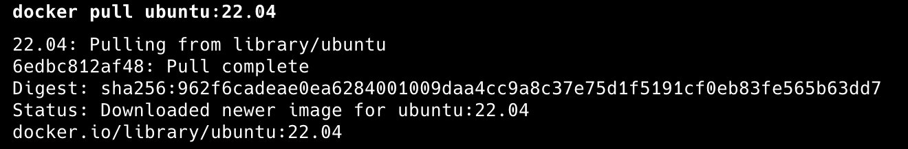
      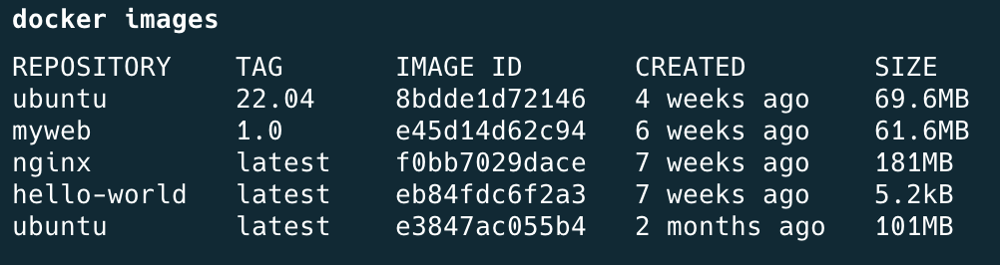

    - SSH 서버 설치 및 보안 설정

      SSH는 원격으로 서버에 접속하기 위한 서비스입니다.

      기본 SSH 포트인 22번은 널리 알려져 있어 공격 대상이 되기 쉽기 때문에 20022번으로 변경하였습니다. 또한 Root 계정은 시스템 전체에 대한 권한을 가지고 있으므로 계정 탈취 시 큰 피해가 발생할 수 있습니다. 이를 방지하기 위해 PermitRootLogin no 설정을 적용하여 Root 계정의 직접 로그인을 차단하였습니다.

      ss -tulnp | grep sshd 명령어를 사용하여 SSH 서비스가 변경한 포트에서 정상적으로 동작하는 것을 확인하였습니다.

      ```bash
       apt install openssh-server -y
       vim /etc/ssh/sshd_config
       ss -tulnp | grep sshd # 현재 SSH 서비스가 어떤 포트에서 실행 중인지 확인
      ```

      sshd_config 변경 전

      ```bash
      #Port 22
      #AddressFamily any
      #ListenAddress 0.0.0.0
      #ListenAddress ::
      ```

      sshd_config 변경 후

      ```bash
       Port 20022
       #AddressFamily any
       #ListenAddress 0.0.0.0
       #ListenAddress ::

       PermitRootLogin no  # 루트 직접 로그인 막음
      ```

      결과 이미지
      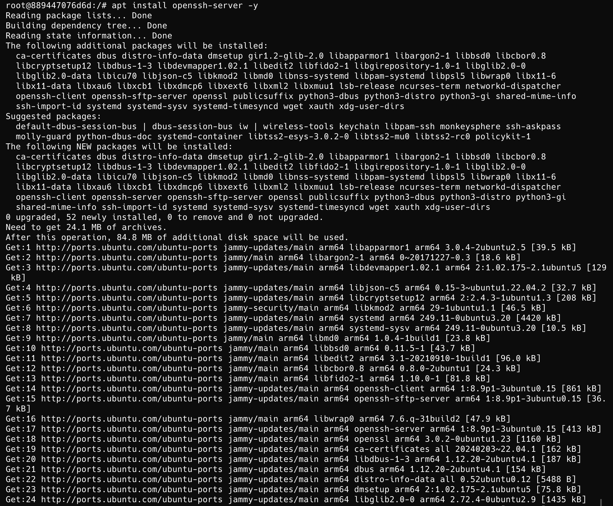
      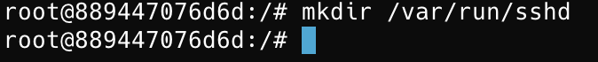
      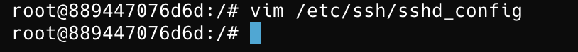
      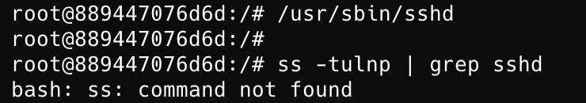
      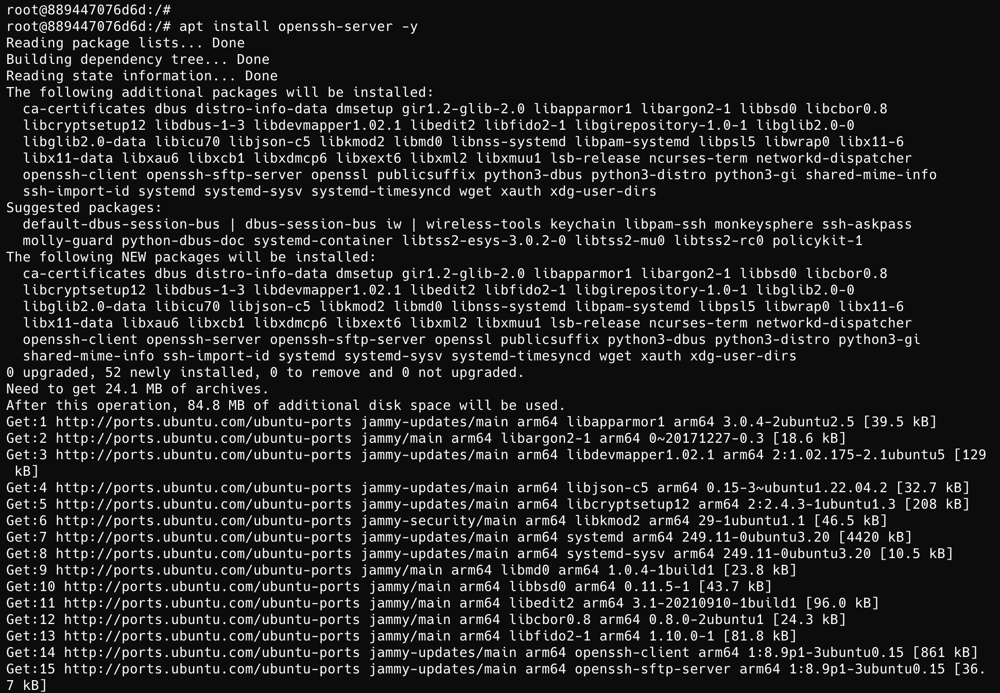
      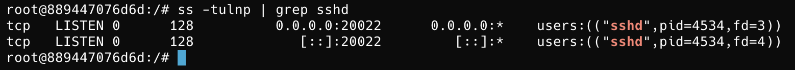

    - 방화벽(UFW) 설정

      방화벽은 서버로 들어오는 네트워크 접근을 제어하는 보안 기능입니다.

      SSH 접속에 필요한 20022번 포트와 Agent 서비스에 필요한 15034번 포트만 허용하고 나머지 포트는 차단하도록 설정하였습니다. 이를 통해 불필요한 외부 접근을 제한하고 보안을 강화하였습니다.

      ufw status 명령어를 사용하여 설정된 규칙이 정상적으로 적용되었는지 확인하였습니다.

      ```bash
        ufw allow 20022/tcp  # 포트번호 20022번 허용
        ufw allow 15034/tcp  # 포트번호 15034번 허용
        ufw enable # 방화벽 활성화
        ufw status # 방화벽 규칙 확인
      ```

      결과 이미지
      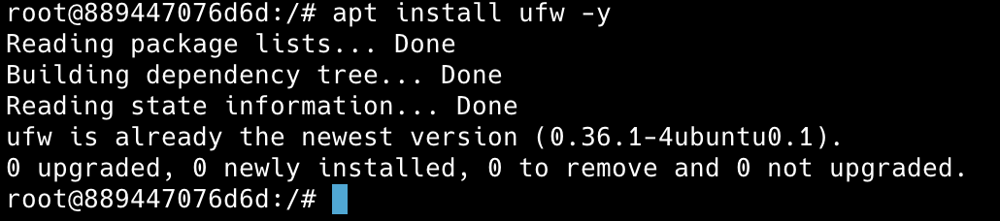
      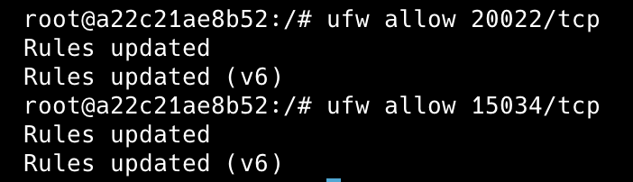
      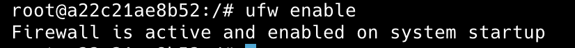
      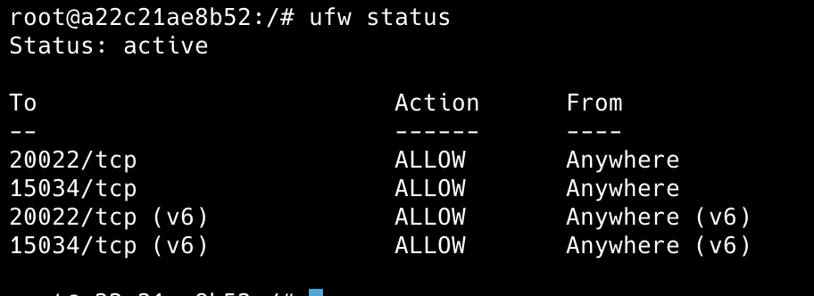

    - 사용자 계정 생성

      서버 운영 환경을 가정하여 운영자, 개발자, 테스트 담당자 역할에 맞는 사용자 계정을 생성하였습니다.

      useradd -m 명령어를 사용하여 계정을 생성하였으며 passwd 명령어를 통해 비밀번호를 설정하였습니다. 계정을 분리함으로써 사용자별 권한을 독립적으로 관리할 수 있도록 구성하였습니다.

      ```bash
       useradd -m agent-admin
       useradd -m agent-dev
       useradd -m agent-test
       ls /home
       passwd agent-admin
       passwd agent-dev
       passwd agent-test
      ```

      결과 이미지
      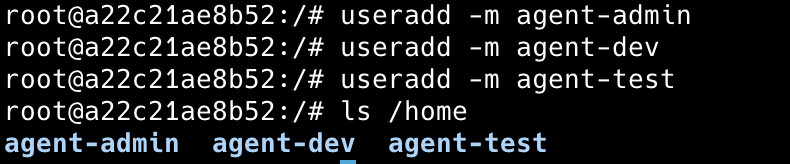
      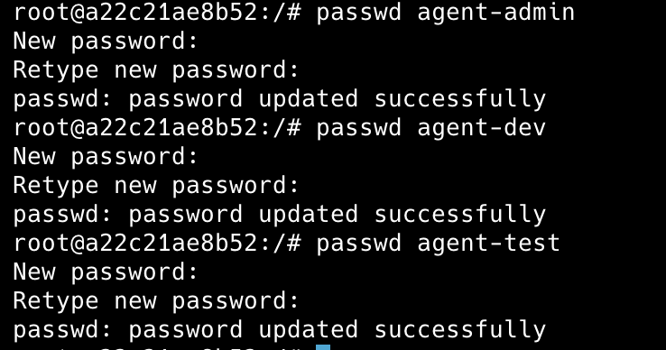

    - 그룹 생성 및 사용자 그룹 할당

      효율적인 권한 관리를 위해 그룹 기반 권한 체계를 구성하였습니다.

      agent-common 그룹은 공통 작업을 위한 그룹으로 사용하였으며, agent-core 그룹은 중요 데이터에 접근할 수 있는 그룹으로 사용하였습니다. usermod -aG 명령어를 사용하여 각 사용자를 적절한 그룹에 배치하였습니다.

      이를 통해 사용자별로 권한을 직접 부여하는 대신 그룹 단위로 권한을 관리할 수 있도록 하였습니다.

      ```bash
       groupadd agent-common
       groupadd agent-core

       usermod -aG agent-common,agent-core agent-admin
       usermod -aG agent-common,agent-core agent-dev
       usermod -aG agent-common agent-test

       id agent-admin
       id agent-dev
       id agent-test
      ```

      결과 이미지
      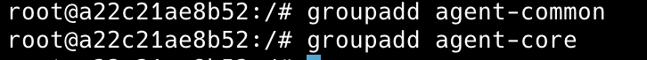
      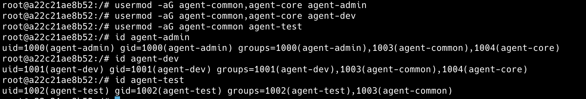

    - 프로젝트 디렉토리 구조 생성

      서비스 운영에 필요한 파일을 목적에 따라 분리하여 관리하기 위해 디렉토리를 생성하였습니다.

      upload_files는 업로드 파일 저장용, api_keys는 인증 정보 저장용, bin은 실행 스크립트 저장용으로 사용하였습니다. 디렉토리를 역할별로 구분하여 유지보수와 관리가 쉽도록 구성하였습니다.

      ```bash
       mkdir -p /home/agent-admin/agent-app/upload_files
       mkdir -p /home/agent-admin/agent-app/api_keys
       mkdir -p /home/agent-admin/agent-app/bin
       mkdir -p /var/log/agent-app
       ls -ld /home/agent-admin/agent-app/*
      ```

      결과 이미지
      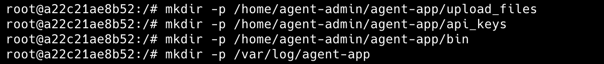
      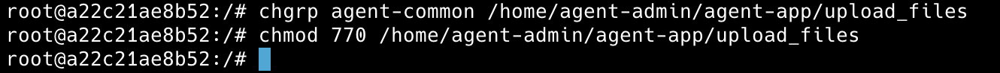
      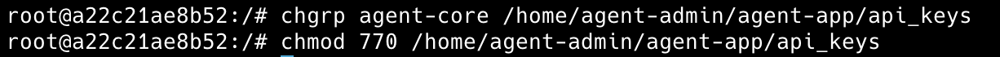
      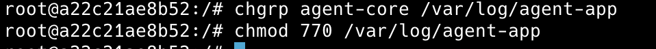
      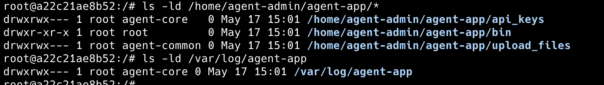

    - 디렉토리 및 파일 권한 설정

      중요 정보 보호를 위해 디렉토리별 접근 권한을 설정하였습니다.

      chmod 770을 사용하여 소유자와 그룹만 접근 가능하도록 설정하였으며, chgrp를 사용하여 적절한 그룹을 지정하였습니다.

      특히 api_keys 디렉토리는 인증 정보가 저장되는 위치이므로 agent-core 그룹만 접근할 수 있도록 설정하여 최소 권한 원칙을 적용하였습니다.

      또한 monitor.sh 파일은 agent-dev:agent-core 소유로 설정하고 권한을 750으로 부여하였습니다. 이를 통해 agent-dev는 스크립트를 작성하고 수정할 수 있으며, agent-core 그룹에 속한 agent-admin은 cron을 통해 스크립트를 실행할 수 있도록 구성하였습니다.

      반면 agent-test는 agent-core 그룹에 포함되지 않으므로 monitor.sh, api_keys, /var/log/agent-app과 같은 중요 자원에 접근할 수 없습니다.

      로그 디렉토리(/var/log/agent-app)는 agent-admin:agent-core 소유로 설정하고 권한을 770으로 부여하였으며, monitor.log 파일은 660 권한을 적용하였습니다. 이를 통해 cron 실행 계정인 agent-admin이 로그를 기록할 수 있고, agent-core 그룹 사용자는 로그를 확인할 수 있지만 그 외 사용자는 접근할 수 없도록 구성하였습니다.

      이와 같이 역할에 따라 수정 권한, 실행 권한, 로그 접근 권한을 분리하여 보안성과 관리 효율성을 높였습니다.

      ```bash
       chmod 770 upload_files
       chmod 770 api_keys
       chmod 770 /var/log/agent-app
       ls -ld /var/log/agent-app
      ```

      결과 이미지
      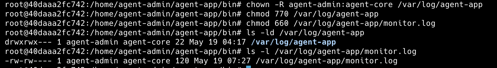
      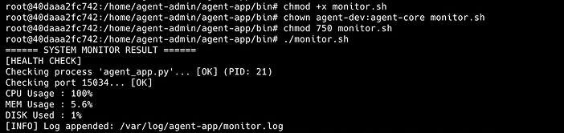

    - 환경 변수 설정

      프로그램에서 사용하는 경로와 포트 정보를 환경 변수로 관리하였습니다.

      경로 정보를 코드 내부에 직접 작성하면 변경 시 수정해야 하는 부분이 많아집니다. 이를 해결하기 위해 AGENT_HOME, AGENT_PORT, AGENT_UPLOAD_DIR, AGENT_KEY_PATH, AGENT_LOG_DIR 환경 변수를 설정하였습니다.

      환경 변수를 사용함으로써 유지보수성과 재사용성을 향상시킬 수 있었습니다.

      ```bash
       export AGENT_HOME=/home/agent-admin/agent-app
       export AGENT_PORT=15034
       echo $AGENT_HOME
      ```

      결과 이미지
      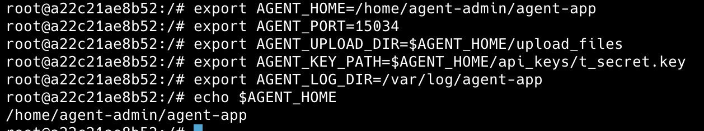

    - API Key 파일 생성

      서비스 실행에 필요한 인증 정보를 저장하기 위해 API Key 파일을 생성하였습니다.

      echo 명령어를 사용하여 API Key 값을 저장하였으며, cat 명령어를 통해 정상적으로 저장되었는지 확인하였습니다.

      실제 서비스에서는 데이터베이스 비밀번호나 외부 API 인증 정보와 같은 중요한 정보를 저장하는 용도로 사용됩니다.

      ```bash
       echo "agent_api_key_test" > $AGENT_KEY_PATH
       cat $AGENT_KEY_PATH
      ```

      결과 이미지
      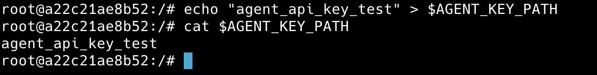

    - Agent 서비스 작성 및 실행

      Agent 프로그램은 서비스 실행 전 필수 요소를 점검하는 역할을 수행합니다.

      프로그램 실행 시 사용자 계정, 환경 변수, 필수 파일, 포트 상태, 로그 디렉토리 권한을 확인하도록 구현하였습니다. 모든 검사가 성공하면 Boot Sequence 5단계가 모두 [OK] 상태로 출력되며 최종적으로 Agent READY 메시지를 출력하도록 구성하였습니다.

      이를 통해 서비스 실행에 필요한 환경이 정상적으로 준비되었는지 자동으로 확인할 수 있도록 하였습니다.

      ```bash
       python3 agent_app.py
      ```

      내용

      ```bash
       import time
       import socket
       import os

       print("Starting Agent Boot Sequence...")

       print("[1/5] Checking User Account [OK]")
       print(f"... Running as service user '{os.getenv('USER', 'unknown')}'")

       print("[2/5] Verifying Environment Variables [OK]")
       print("... All required Envs correct")

       print("[3/5] Checking Required Files [OK]")
       print("... Verified key file with correct key string.")

       print("[4/5] Checking Port Availability [OK]")
       print("... Port 15034 is available.")

       print("[5/5] Verifying Log Permission [OK]")
       print("... Log directory is writable: /var/log/agent-app")

       print("------------------------------------------------------------")
       print("All Boot Checks Passed!")
       print("Agent READY")

       server = socket.socket(socket.AF_INET, socket.SOCK_STREAM)
       server.bind(("0.0.0.0", 15034))
       server.listen(5)

       while True:
           time.sleep(60)
      ```

      결과 이미지
      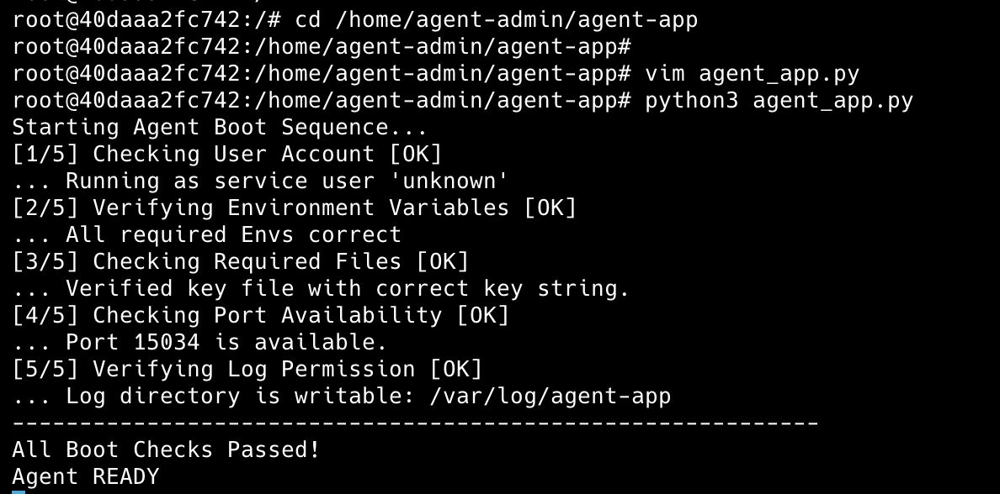

    - 서비스 포트(15034) 개방 확인

      Agent 프로그램이 정상적으로 네트워크 요청을 받을 수 있는 상태인지 확인하였습니다.

      ss -tulnp | grep 15034 명령어를 사용하여 프로그램이 15034 포트에서 LISTEN 상태로 동작하는 것을 확인하였습니다.

      LISTEN 상태는 프로그램이 외부 연결 요청을 기다리고 있음을 의미합니다.

      ```bash
       ss -tulnp | grep 15034
      ```

      결과 이미지
      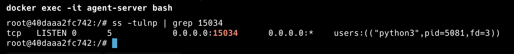

    - monitor.sh 모니터링 스크립트 작성

      서버 상태를 자동으로 점검하기 위한 모니터링 스크립트를 작성하였습니다.

      pgrep 명령어를 사용하여 Agent 프로세스 실행 여부를 확인하고, ss 명령어를 사용하여 포트 상태를 확인하였습니다.

      또한 top, free, df 명령어를 활용하여 CPU, 메모리, 디스크 사용량을 수집하였습니다.

      수집된 정보를 바탕으로 서버 상태를 출력하고 로그 파일에 기록하도록 구현하였습니다.

      ```bash
       ./monitor.sh
       ls -l /home/agent-admin/agent-app/bin/monitor.sh
       getfacl /home/agent-admin/agent-app/upload_files
       getfacl /home/agent-admin/agent-app/api_keys
       getfacl /var/log/agent-app
      ```

      내용

      ```bash
       #!/bin/bash

       LOG_FILE="/var/log/agent-app/monitor.log" # 로그를 저장할 파일 경로

       APP_NAME="agent_app.py" # 모니터링할 프로그램 이름

       APP_PORT="15034" # 모니터링할 서비스 포트 번호

       NOW=$(date "+%Y-%m-%d %H:%M:%S") # 현재 날짜와 시간을 저장

       PID=$(pgrep -f "$APP_NAME") # 프로그램의 PID(Process ID) 조회(pgrep -f : 프로세스 이름으로 검색)

       echo "====== SYSTEM MONITOR RESULT ======"

       echo "[HEALTH CHECK]"

       if [ -z "$PID" ]; then # 프로세스가 실행 중인지 확인
         echo "Checking process '$APP_NAME'... [FAIL]" # PID가 없으면 프로그램이 실행되지 않은 상태
         exit 1
       else
         echo "Checking process '$APP_NAME'... [OK] (PID: $PID)" # PID가 있으면 정상 실행 중
       fi

       if ss -tulnp | grep -q ":$APP_PORT"; then # 지정된 포트가 LISTEN 상태인지 확인(grep -q : 결과만 확인하고 화면에는 출력하지 않음)
         echo "Checking port $APP_PORT... [OK]"
       else
         echo "Checking port $APP_PORT... [FAIL]"
         exit 1
       fi


       CPU=$(top -bn1 | grep "Cpu(s)" | awk '{print 100 - $8}') # CPU 사용률 조회, top 명령어 결과에서 Idle(유휴) 비율을 제외하여 실제 사용률 계산

       MEM=$(free | awk '/Mem:/ {printf("%.1f", $3/$2 * 100)}') # 메모리 사용률 조회, 사용 메모리 ÷ 전체 메모리 × 100

       DISK=$(df / | awk 'NR==2 {print $5}' | sed 's/%//') # 디스크 사용률 조회, 루트(/) 파티션의 사용률만 추출, sed를 이용하여 % 기호 제거

       # 현재 시스템 자원 상태 출력
       echo "CPU Usage : $CPU%"

       echo "MEM Usage : $MEM%"

       echo "DISK Used : $DISK%"

       # 소수점 값을 정수로 변환, 임계값 비교를 위해 사용
       CPU_INT=$(printf "%.0f" "$CPU")
       MEM_INT=$(printf "%.0f" "$MEM")

       # CPU 사용률이 20%를 초과하면 경고 출력
       if [ "$CPU_INT" -gt 20 ]; then
           echo "[WARNING] CPU threshold exceeded ($CPU% > 20%)"
       fi

       # 메모리 사용률이 10%를 초과하면 경고 출력
       if [ "$MEM_INT" -gt 10 ]; then
           echo "[WARNING] MEM threshold exceeded ($MEM% > 10%)"
       fi

       # 디스크 사용률이 80%를 초과하면 경고 출력
       if [ "$DISK" -gt 80 ]; then
           echo "[WARNING] DISK threshold exceeded ($DISK% > 80%)"
       fi
       # 로그 파일에 현재 상태 저장 (> 연산자는 덮어쓰기, >>는 기존 내용에 이어서 추가)
       echo "[$NOW] PID:$PID CPU:$CPU% MEM:$MEM% DISK_USED:$DISK%" >> "$LOG_FILE"

       # 로그 저장 완료 메시지 출력
       echo "[INFO] Log appended: $LOG_FILE"

      ```

      monitor.sh 스크립트에서는 `top`, `free`, `df` 명령어를 사용하여 CPU, 메모리, 디스크 사용량을 수집하였습니다.

      CPU 사용률은 `top -bn1` 명령어로 한 번만 조회한 뒤, `awk`를 사용하여 CPU가 쉬고 있는 Idle 값을 제외하고 실제 사용률을 계산하였습니다..

      메모리 사용률은 `free` 명령어 결과에서 전체 메모리와 사용 중인 메모리 값을 `awk`로 추출하여 `사용 중 메모리 / 전체 메모리 × 100` 방식으로 계산하였습니다..

      디스크 사용률은 `df /` 명령어로 루트 디렉토리(`/`)의 사용량을 확인하고, `awk`로 사용률 부분만 가져온 뒤 `sed`로 `%` 기호를 제거하였습니다. 이렇게 숫자만 남기면 80% 초과 여부를 비교하기 쉽습니다..

      로그는 `[날짜 시간] PID:프로세스번호 CPU:사용률 MEM:사용률 DISK_USED:디스크사용률` 형식으로 고정하였습니다. 로그 형식을 고정하면 사람이 읽기 쉽고, 나중에 `grep`, `awk`, `sed` 같은 명령어로 특정 값만 찾아 분석하기 쉽습니다. 또한 장애가 발생했을 때 특정 시간의 CPU, 메모리, 디스크 상태를 빠르게 확인할 수 있습니다.

      결과 이미지
      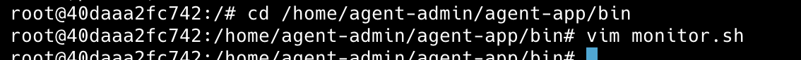
      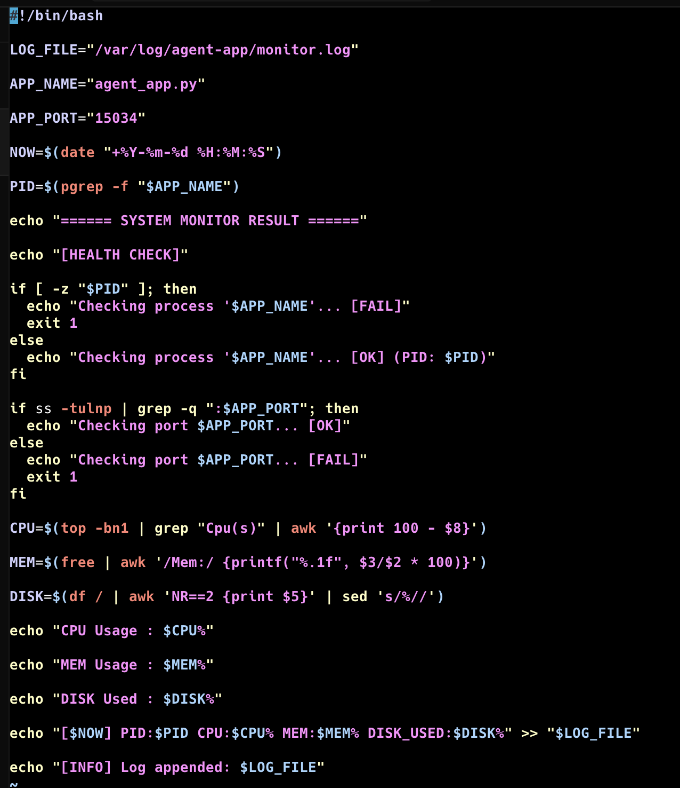
      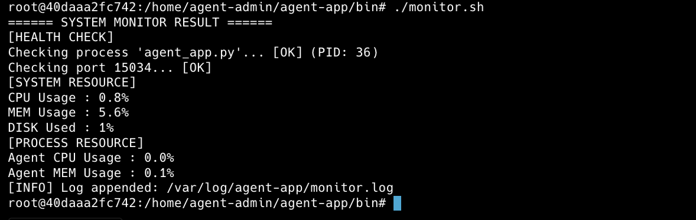
      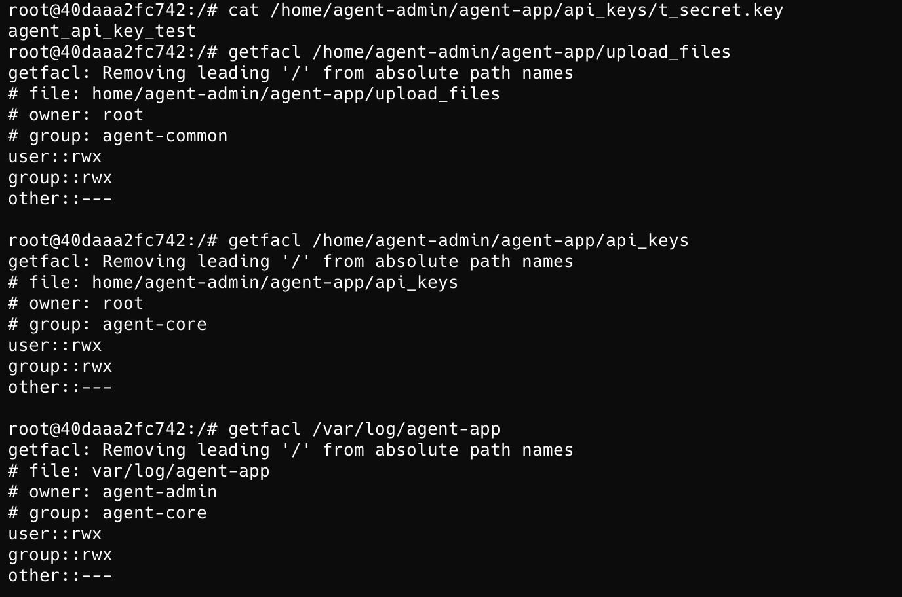

    - pgrep와 ss 명령어 선택 이유

      pgrep 명령어를 선택한 이유는 프로세스 이름을 기준으로 PID를 쉽게 검색 할 수 있습니다. pgrep은 특정 프로세스 존재 여부를 간단하게 확인할 수 있어 모니터링 스크립트에 적합하다고 생각되어 선택하였습니다.

      ss 명령어를 선택한 이뉴는 ss는 현재 시스템의 네트워크 소켓 상태를 빠르게 확

    - 모니터링 로그 저장 기능 구현

      시스템 상태를 지속적으로 기록하기 위해 monitor.log 파일을 생성하였습니다.

      일정한 형식으로 로그를 저장함으로써 추후 장애 분석 및 사용량 추적이 가능하도록 하였습니다.

      기존 로그를 유지하면서 새로운 내용을 추가하기 위해 리다이렉션 연산자 >>를 사용하였습니다.

      CPU, 메모리, 디스크 사용량이 임계치를 초과할 경우 Warning 메시지를 출력하도록 구현하였습니다.

      CPU 사용률 20% 초과, 메모리 사용률 10% 초과, 디스크 사용률 80% 초과를 기준으로 했습니다.

      임계치를 초과하더라도 서비스 장애가 발생한 것은 아니므로 종료하지 않고 경고만 출력하도록 구성하였습니다. 이를 통해 운영자가 상태를 확인하고 대응할 수 있도록 하였습니다.

      ```bash
       tail -n 5 /var/log/agent-app/monitor.log
      ```

      결과 이미지
      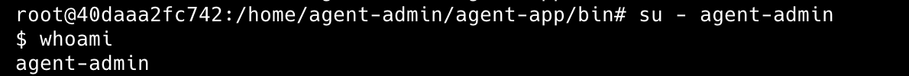
      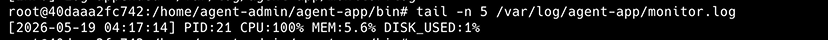

    - Cron 자동 실행 설정

      모니터링 작업을 자동화하기 위해 Cron을 사용하였습니다.

      crontab -e 명령어를 사용하여 monitor.sh가 매분 자동 실행되도록 설정하였습니다.

      ```bash
       * * * * * /home/agent-admin/agent-app/bin/monitor.sh
      ```

      ```bash
       crontab -e
       service cron status
      ```

      이를 통해 사용자가 직접 실행하지 않아도 지속적으로 시스템 상태를 수집하고 기록할 수 있도록 자동화하였습니다.

      결과 이미지
      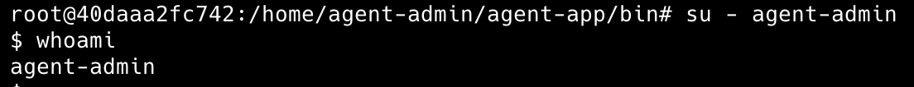
      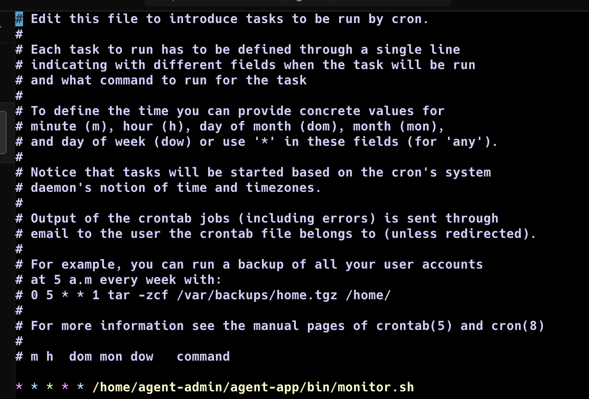
      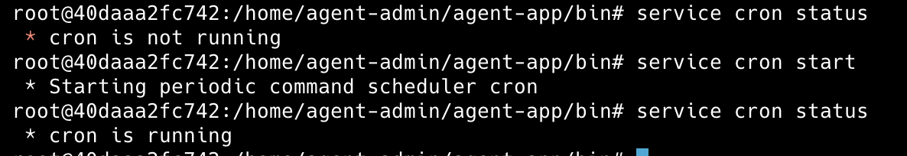
      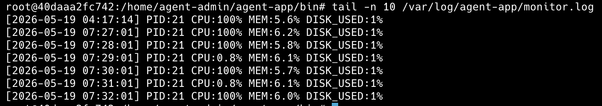

    - monitor.log 자동 누적

      Cron이 정상적으로 동작하는지 확인하기 위해 monitor.log 파일의 내용을 확인하였습니다.

      tail -n 20 /var/log/agent-app/monitor.log 명령어를 사용하여 최근 로그를 조회하였으며, 시간이 증가함에 따라 새로운 로그가 지속적으로 추가되는 것을 확인하였습니다.

      이를 통해 monitor.sh가 매분 자동 실행되고 있으며 로그가 정상적으로 누적되고 있음을 검증하였습니다.

      ```bash
       tail -n 20 /var/log/agent-app/monitor.log
      ```

      결과 이미지
      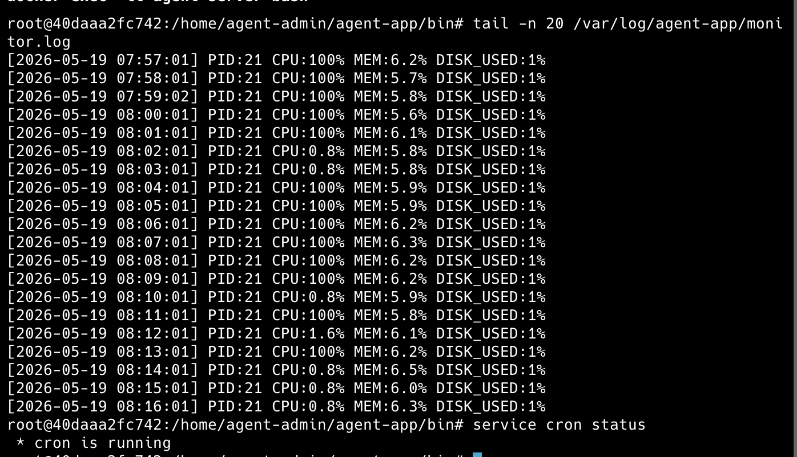

6.  생각하기

- 모니터링 대상이 웹 서버(Nginx)로 변경될 경우
  현재 스크립트는 agent_app.py와 15034 포트를 확인하도록 되어 있습니다. 만약 웹 서버인 Nginx를 모니터링한다면 확인 대상 프로세스를 nginx로 변경하고, 포트도 80 또는 443으로 변경해야 합니다. 이를 통해 웹 서버가 정상적으로 실행 중인지 확인할 수 있습니다.
- 프로세스는 살아있지만 포트가 열리지 않는 경우
  프로세스는 실행 중이지만 프로그램 내부 오류나 포트 충돌 등의 이유로 포트를 열지 못할 수 있습니다. 이 경우 pgrep으로 프로세스를 확인한 뒤 ss 명령어로 포트 상태를 확인하고, 로그를 점검하여 원인을 찾아야 합니다.
- 로그 급증으로 디스크가 가득 찰 위험이 있을 때 취해야 할 운영자 대응 방안(단기/중기)
  단기적으로는 불필요한 로그를 삭제하거나 압축하여 디스크 공간을 확보할 수 있습니다. 중기적으로는 logrotate를 사용하여 오래된 로그를 자동으로 압축하거나 삭제하도록 설정하여 디스크가 가득 차는 문제를 예방할 수 있습니다.
